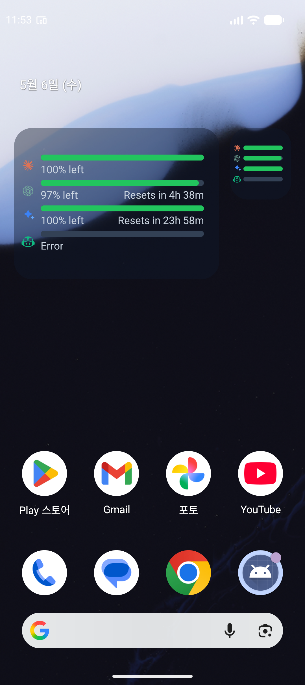

# AI Usage for Mobile

English | [한국어](#한국어)

---

## English

AI Usage for Mobile is the Android companion app for [AI Usage for Windows](https://github.com/datell1357/AI-Usage-for-Windows). It shows AI usage limit snapshots synced from the Windows app, with an Android dashboard, home screen widgets, and a pinned silent notification.



### Download

The Android app is being prepared for Google Play internal testing.

Current upload artifact:

```text
android/app/build/outputs/bundle/release/app-release.aab
```

For now, install from source with the Android debug or release build commands below.

### What This App Does

AI Usage for Mobile does not collect provider credentials directly. The Windows app signs in with Google, reads provider usage locally on the Windows PC, sanitizes the snapshot, and uploads the latest display data to Firebase. The Android app signs in with the same Google account and displays the synced snapshot.

### Features

- Android-first mobile viewer for AI Usage snapshots.
- Google sign-in with Firebase Authentication.
- Firestore-backed device list and latest snapshot sync.
- Home dashboard focused on remaining AI usage limits.
- Settings panel for connected devices, selected device, device rename, manual refresh, notification toggle, and sign out.
- Android home screen widgets in compact and expanded sizes.
- Pinned silent notification with provider summaries and expandable gauge rows.
- Automatic refresh while the app is open.
- Best-effort background refresh for widget and notification cache.
- Korean UI strings for settings when the device language is Korean.
- Google Play release signing and store listing assets prepared.

### Supported Providers

The mobile app displays the active providers included in the synced Windows snapshot. Provider visibility and order are controlled by the Windows app settings.

| Provider | Mobile Status | Notes |
| --- | --- | --- |
| Claude | Available | Remaining session, weekly, and related limits when uploaded by Windows. |
| Codex | Available | Remaining session, weekly, Spark, credits, and related limits when uploaded by Windows. |
| Gemini | Available | Gemini Pro / Flash limits when uploaded by Windows. |
| GitHub Copilot | Available | Copilot limits or provider error state when uploaded by Windows. |
| Antigravity | Hidden when disabled | Displayed only if enabled and included in the Windows snapshot. |
| Cursor | Hidden when disabled | Displayed only if enabled and included in the Windows snapshot. |

Providers marked disabled in the Windows app are hidden from the Android dashboard, widgets, and pinned notification.

### App Flow

1. Sign in with Google.
2. Load the signed-in user's Windows device list from Firestore.
3. Select the most recent active device by default.
4. Read `/users/{uid}/devices/{deviceId}/snapshots/latest`.
5. Render only active providers from that snapshot.
6. Cache display-only snapshot data locally for widgets and pinned notification.
7. Refresh the selected snapshot every 60 seconds while the app is open.
8. Schedule best-effort background refresh every 5 minutes.

### Firebase Model

This mobile implementation uses the free Firebase-friendly model. It does not require Cloud Functions, Secret Manager, Blaze billing, or pairing codes.

Required Firebase services:

- Firebase Authentication with Google provider enabled.
- Cloud Firestore.
- Android Firebase app registered with package name `com.aiusage.mobile`.
- `google-services.json` placed at `android/app/google-services.json`.
- Debug, release upload, and Play App Signing SHA fingerprints registered for Google sign-in.

Firestore paths:

```text
/users/{uid}
/users/{uid}/devices/{deviceId}
/users/{uid}/devices/{deviceId}/snapshots/latest
```

### Data Safety

The mobile app is designed to display sanitized usage snapshots only.

It must not store:

- Provider access tokens.
- Refresh tokens.
- API keys.
- Local file paths.
- Raw logs.
- Authentication file contents.
- Provider credential files.

See:

- [Privacy Policy](docs/privacy-policy.md)
- [Google Play Data Safety Draft](docs/store/data-safety.md)

### Documentation

- [Google Play listing draft](docs/store/play-listing.md)
- [Google Play release checklist](docs/store/release-checklist.md)
- [Data Safety draft](docs/store/data-safety.md)
- [Privacy Policy](docs/privacy-policy.md)
- [Privacy Policy HTML](docs/privacy-policy.html)
- [Store assets](store-assets/google-play)
- [AI Usage for Windows](https://github.com/datell1357/AI-Usage-for-Windows)

### Build From Source

#### Requirements

- Windows development machine.
- Android Studio with Android SDK.
- JDK 17. Android Studio JBR works.
- Firebase project configured for Android package `com.aiusage.mobile`.
- `android/app/google-services.json`.
- Existing Gradle wrapper distribution or Gradle 8.10.2.

#### Test

```powershell
npm.cmd test
```

```powershell
$env:JAVA_HOME='C:\Program Files\Android\Android Studio\jbr'
$env:Path="$env:JAVA_HOME\bin;$env:Path"
& 'C:\Users\datell1357\.gradle\wrapper\dists\gradle-8.10.2-bin\a04bxjujx95o3nb99gddekhwo\gradle-8.10.2\bin\gradle.bat' -p android :app:testDebugUnitTest
```

#### Build Debug APK

```powershell
$env:JAVA_HOME='C:\Program Files\Android\Android Studio\jbr'
$env:Path="$env:JAVA_HOME\bin;$env:Path"
& 'C:\Users\datell1357\.gradle\wrapper\dists\gradle-8.10.2-bin\a04bxjujx95o3nb99gddekhwo\gradle-8.10.2\bin\gradle.bat' -p android :app:assembleDebug
```

#### Install Debug APK on Emulator

```powershell
$env:JAVA_HOME='C:\Program Files\Android\Android Studio\jbr'
$env:Path="$env:JAVA_HOME\bin;$env:Path"
& 'C:\Users\datell1357\.gradle\wrapper\dists\gradle-8.10.2-bin\a04bxjujx95o3nb99gddekhwo\gradle-8.10.2\bin\gradle.bat' -p android :app:installDebug
```

#### Build Google Play AAB

Create local signing files first:

```text
android/keystore.properties
android/keystores/ai-usage-upload.jks
```

These files are intentionally ignored by Git.

Build:

```powershell
$env:JAVA_HOME='C:\Program Files\Android\Android Studio\jbr'
$env:Path="$env:JAVA_HOME\bin;$env:Path"
& 'C:\Users\datell1357\.gradle\wrapper\dists\gradle-8.10.2-bin\a04bxjujx95o3nb99gddekhwo\gradle-8.10.2\bin\gradle.bat' -p android :app:lintRelease :app:bundleRelease
```

Output:

```text
android/app/build/outputs/bundle/release/app-release.aab
```

### Current Scope

- Android app: active.
- Android widgets: active.
- Pinned Android notification: active.
- Google Play internal testing preparation: active.
- iOS app and Apple sign-in: on hold until explicitly resumed.
- Cloud Functions pairing flow: legacy design, not required for the current free Firebase plan.

### Credits

Built as the Android mobile companion for [AI Usage for Windows](https://github.com/datell1357/AI-Usage-for-Windows).

### License

MIT

---

## 한국어

AI Usage for Mobile은 [AI Usage for Windows](https://github.com/datell1357/AI-Usage-for-Windows)의 Android 동반 앱입니다. Windows 앱이 Firebase에 동기화한 AI 사용 한도 snapshot을 Android 앱, 홈 화면 위젯, 고정 무음 알림에서 확인할 수 있습니다.


### 다운로드

Android 앱은 현재 Google Play 내부 테스트 업로드를 준비 중입니다.

현재 업로드 산출물:

```text
android/app/build/outputs/bundle/release/app-release.aab
```

아직 공개 Play Store 릴리즈 전이므로, 현재는 아래 소스 빌드 명령으로 설치할 수 있습니다.

### 앱 동작 방식

AI Usage for Mobile은 provider credential을 직접 수집하지 않습니다. Windows 앱이 Google 계정으로 로그인한 뒤 Windows PC 로컬에서 provider 사용량을 읽고, 민감 정보를 제거한 표시용 snapshot만 Firebase에 업로드합니다. Android 앱은 같은 Google 계정으로 로그인해 해당 snapshot을 표시합니다.

### 주요 기능

- AI Usage snapshot을 확인하는 Android 우선 모바일 앱.
- Firebase Authentication 기반 Google 로그인.
- Firestore 기반 연결 장치 목록 및 최신 snapshot 동기화.
- 남은 AI 사용 한도 중심의 홈 대시보드.
- 설정 화면에서 연결 장치, 선택 장치, 장치 이름 변경, 수동 새로고침, 알림 토글, 로그아웃 관리.
- Android 홈 화면 1x1 / 3x2 위젯.
- provider 요약과 확장 게이지를 제공하는 고정 무음 알림.
- 앱 실행 중 60초마다 자동 새로고침.
- 위젯과 알림 cache를 위한 5분 단위 best-effort 백그라운드 새로고침.
- 휴대폰 언어가 한국어일 때 설정 UI 한국어 표시.
- Google Play release signing 및 스토어 등록 asset 준비.

### 지원 Provider

모바일 앱은 Windows snapshot에 포함된 활성 provider만 표시합니다. 표시 여부와 순서는 Windows 앱 설정을 따릅니다.

| Provider | 모바일 상태 | 설명 |
| --- | --- | --- |
| Claude | 지원 | Windows에서 업로드한 세션, 주간, 관련 남은 한도 표시. |
| Codex | 지원 | Windows에서 업로드한 세션, 주간, Spark, credits 등 표시. |
| Gemini | 지원 | Windows에서 업로드한 Gemini Pro / Flash 한도 표시. |
| GitHub Copilot | 지원 | Windows에서 업로드한 Copilot 한도 또는 provider error 상태 표시. |
| Antigravity | 비활성 시 숨김 | Windows에서 활성화되고 snapshot에 포함된 경우에만 표시. |
| Cursor | 비활성 시 숨김 | Windows에서 활성화되고 snapshot에 포함된 경우에만 표시. |

Windows 앱에서 disabled 상태인 provider는 Android 홈 화면, 위젯, 고정 알림에서 숨겨집니다.

### 앱 흐름

1. Google 계정으로 로그인합니다.
2. Firestore에서 로그인 사용자의 Windows 장치 목록을 불러옵니다.
3. 가장 최근 활성 장치를 기본 선택합니다.
4. `/users/{uid}/devices/{deviceId}/snapshots/latest`를 읽습니다.
5. snapshot 안의 활성 provider만 렌더링합니다.
6. 위젯과 고정 알림 표시를 위해 표시 전용 snapshot cache를 로컬에 저장합니다.
7. 앱이 열려 있는 동안 선택된 snapshot을 60초마다 새로고침합니다.
8. 백그라운드에서는 5분 단위 best-effort 새로고침을 예약합니다.

### Firebase 모델

현재 모바일 구현은 무료 Firebase 운영 모델을 기준으로 합니다. Cloud Functions, Secret Manager, Blaze 결제, pairing code가 필요하지 않습니다.

필수 Firebase 설정:

- Firebase Authentication에서 Google provider 활성화.
- Cloud Firestore.
- 패키지명 `com.aiusage.mobile` Android Firebase 앱 등록.
- `android/app/google-services.json` 배치.
- Google 로그인용 debug, release upload, Play App Signing SHA 지문 등록.

Firestore 경로:

```text
/users/{uid}
/users/{uid}/devices/{deviceId}
/users/{uid}/devices/{deviceId}/snapshots/latest
```

### 데이터 안전

모바일 앱은 민감 정보가 제거된 표시용 사용량 snapshot만 표시하도록 설계되어 있습니다.

저장하면 안 되는 데이터:

- Provider access token.
- Refresh token.
- API key.
- 로컬 파일 경로.
- 원본 로그.
- 인증 파일 내용.
- Provider credential 파일.

관련 문서:

- [개인정보 처리방침](docs/privacy-policy.md)
- [Google Play Data Safety 초안](docs/store/data-safety.md)

### 문서

- [Google Play 등록 문구 초안](docs/store/play-listing.md)
- [Google Play 릴리즈 체크리스트](docs/store/release-checklist.md)
- [Data Safety 초안](docs/store/data-safety.md)
- [개인정보 처리방침](docs/privacy-policy.md)
- [개인정보 처리방침 HTML](docs/privacy-policy.html)
- [스토어 asset](store-assets/google-play)
- [AI Usage for Windows](https://github.com/datell1357/AI-Usage-for-Windows)

### 소스에서 빌드

#### 요구사항

- Windows 개발 환경.
- Android Studio 및 Android SDK.
- JDK 17. Android Studio JBR 사용 가능.
- Android 패키지 `com.aiusage.mobile`로 설정된 Firebase 프로젝트.
- `android/app/google-services.json`.
- 기존 Gradle wrapper 배포본 또는 Gradle 8.10.2.

#### 테스트

```powershell
npm.cmd test
```

```powershell
$env:JAVA_HOME='C:\Program Files\Android\Android Studio\jbr'
$env:Path="$env:JAVA_HOME\bin;$env:Path"
& 'C:\Users\datell1357\.gradle\wrapper\dists\gradle-8.10.2-bin\a04bxjujx95o3nb99gddekhwo\gradle-8.10.2\bin\gradle.bat' -p android :app:testDebugUnitTest
```

#### Debug APK 빌드

```powershell
$env:JAVA_HOME='C:\Program Files\Android\Android Studio\jbr'
$env:Path="$env:JAVA_HOME\bin;$env:Path"
& 'C:\Users\datell1357\.gradle\wrapper\dists\gradle-8.10.2-bin\a04bxjujx95o3nb99gddekhwo\gradle-8.10.2\bin\gradle.bat' -p android :app:assembleDebug
```

#### 에뮬레이터에 Debug APK 설치

```powershell
$env:JAVA_HOME='C:\Program Files\Android\Android Studio\jbr'
$env:Path="$env:JAVA_HOME\bin;$env:Path"
& 'C:\Users\datell1357\.gradle\wrapper\dists\gradle-8.10.2-bin\a04bxjujx95o3nb99gddekhwo\gradle-8.10.2\bin\gradle.bat' -p android :app:installDebug
```

#### Google Play AAB 빌드

먼저 로컬 서명 파일이 필요합니다.

```text
android/keystore.properties
android/keystores/ai-usage-upload.jks
```

이 파일들은 Git에 포함하지 않습니다.

빌드:

```powershell
$env:JAVA_HOME='C:\Program Files\Android\Android Studio\jbr'
$env:Path="$env:JAVA_HOME\bin;$env:Path"
& 'C:\Users\datell1357\.gradle\wrapper\dists\gradle-8.10.2-bin\a04bxjujx95o3nb99gddekhwo\gradle-8.10.2\bin\gradle.bat' -p android :app:lintRelease :app:bundleRelease
```

출력:

```text
android/app/build/outputs/bundle/release/app-release.aab
```

### 현재 범위

- Android 앱: 활성.
- Android 위젯: 활성.
- Android 고정 알림: 활성.
- Google Play 내부 테스트 준비: 활성.
- iOS 앱 및 Apple 로그인: 명시적으로 재개하기 전까지 보류.
- Cloud Functions pairing flow: 현재 무료 Firebase 모델에서는 필요하지 않은 legacy 설계.

### 크레딧

[AI Usage for Windows](https://github.com/datell1357/AI-Usage-for-Windows)의 Android 모바일 동반 앱으로 제작되었습니다.

### 라이선스

MIT
