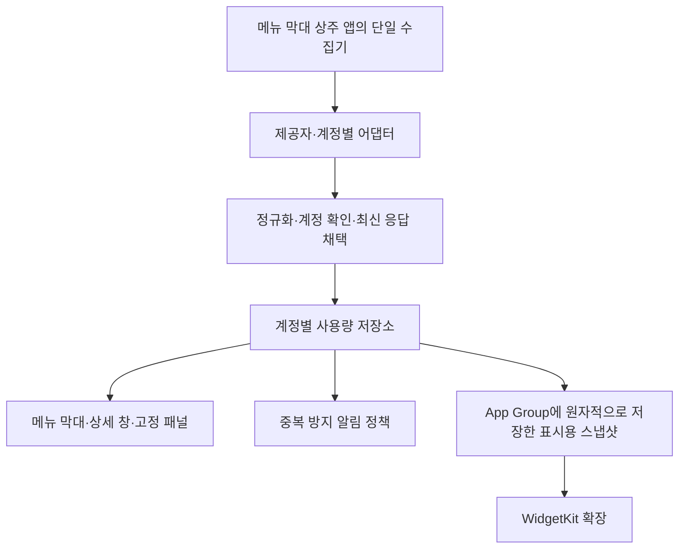

# AI Quota macOS 구현 계획

작성일: 2026-09-16. 상태: 설계 제안. macOS 구현·빌드·실계정 검증은 아직 수행하지 않았다.

## 1. 목표와 기준

AI Quota Android 1.2.2(55)의 사용자 기능을 유지하는 macOS 네이티브 앱을 만든다. 주 사용 화면은 메뉴 막대와 데스크톱 위젯이며, 계정 연결·상세 사용량·설정은 별도 창에서 제공한다. 코드와 화면 배치를 Android와 같게 만드는 것이 아니라 동일한 계정의 동일한 한도·잔여량·리셋 시점을 정확하게 보여주는 것을 완료 기준으로 삼는다.

- 모바일 기준: `artifacts/release-1.2.2-55/source-manifest.json`. 작성 시점에 기록된 718개 파일을 현재 파일과 SHA-256 대조해 변경·누락 0개를 확인했다.
- 현재 Git 작업본에는 릴리스 복구 수정이 커밋되지 않은 상태로 남아 있다. GitHub 최신 커밋만으로 55 기능을 재구성하지 않는다. 구현 시작 시 이 스냅샷과 회귀 사례를 기준으로 삼는다.
- 참고 포크: [datell1357/CodexBar](https://github.com/datell1357/CodexBar), 확인한 커밋 `928166f899471bbdcb72210641cdec91324d0154`.
- README의 릴리스 다중 계정 비활성화 설명은 현재 코드와 다르다. 실제 `build.gradle.kts`는 릴리스에서도 다중 계정을 활성화한다. 기능 판단은 현재 코드·릴리스 기록을 우선한다.
- 대상 제공자는 Claude, Codex, Cursor, Grok, Kiro, OpenCode, GLM, Antigravity, Gemini, GitHub Copilot의 10개다. Kimi는 enum·일부 구현은 있지만 현재 `defaultOrder()`에서 노출하지 않아 이번 동등 기능 범위에 넣지 않는다.
- Claude·Codex는 복수 계정을 동시에 수집·표시한다. 나머지는 현재 모바일처럼 기본 한 계정을 지원하되 내부 모델은 계정 단위로 설계한다.

## 2. 구현 방식

**Swift 6.2 이상 + SwiftUI + 필요한 AppKit + WidgetKit**, 최소 macOS 14를 권장한다. 포크의 `Package.swift`도 macOS 14와 Swift 6.2를 기준으로 하고, `CodexBarCore`를 라이브러리 product로 노출한다.

앱 자체는 AI Quota 전용으로 만들고, CodexBar의 수집·파싱 기능을 고정 커밋의 Swift Package 의존성으로 연결한다. 매분 별도 CodexBar CLI를 실행하는 구조를 기본으로 삼지 않는다. 코어의 공개 인터페이스 밖에 있는 로그인·세션 보조 로직은 필요한 부분만 출처와 원본 커밋을 기록해 어댑터로 옮긴다.

초기 저장소 배치는 현재 저장소의 `macos/`를 권장한다. Android의 기능 계약·익명화된 응답 fixture와 수정 이력을 함께 비교하기 쉽다. 추후 별도 저장소로 분리할 수 있도록 Gradle 및 Android 자원에 대한 빌드 의존성은 만들지 않는다.

```text
macos/
  AIQuota.xcodeproj              # 호스트 앱 + WidgetKit 확장
  App/                          # 수명주기, 메뉴 막대, 대시보드, 설정, 로그인
  Packages/AIQuotaCore/          # 계정·사용량 모델, 저장소, 알림 정책
  Packages/AIQuotaCollectors/    # CodexBarCore 어댑터 + Gemini 웹 수집 등
  Widgets/                      # 제공자·대시보드·배터리 위젯
  Tests/                        # 정책·파서·마이그레이션·UI 검증
  THIRD_PARTY_NOTICES.md         # 채택 코드 및 의존성 고지
```

CodexBarCore가 앱 전역 설정·파일 경로·플러그인 자원·보조 실행 파일에 의존하는 부분을 먼저 확인한다. 연결만 하면 독립적으로 완성되는 엔진이라고 가정하지 않는다. 특히 GLM의 실제 파싱에는 `Resources/Plugins/zai.js`가 포함되므로 Swift 파일만 복사하지 않는다. 필요한 코어 수정은 작은 호환 패치로 분리하고, 이후 포크 갱신은 회귀 fixture 통과 후 반영한다. MIT 고지 및 포함 의존성의 라이선스를 배포물에 유지한다.

## 3. 화면과 위젯

### 메뉴 막대

- 기본은 AI Quota 아이콘 하나와 사용자가 고른 대표 계정의 잔여율이다. 메뉴 막대 폭에 맞춰 간결하게 표시한다.
- 클릭하면 SwiftUI 패널을 열어 연결 계정의 잔여량, 기간, 리셋 시간, 최신 수집 시각을 보여준다. 계정이 많으면 패널에서 스크롤한다.
- 고정 계정 요약은 최대 6개까지 고를 수 있다. 나머지 연결 계정도 전체 목록에서 확인할 수 있다.
- 2열 요약의 순서는 왼쪽→오른쪽, 위→아래로 통일한다. 축소·확장·위젯 간 같은 선택 순서를 사용한다.
- 개별/전체 새로고침, 상세 보기, 설정, 자동 수집 켜기/끄기, 종료를 제공한다.
- 처음에는 `MenuBarExtra`의 window 스타일을 사용한다. 여러 개의 독립 상태 아이콘이나 정밀한 폭 제어가 필요한 경우에만 `NSStatusItem`을 추가한다.

### 시스템 위젯

WidgetKit으로 데스크톱과 알림 센터에서 추가할 수 있는 세 종류를 제공한다.

| 유형 | 내용 | 제안 크기·용량 |
| --- | --- | --- |
| 제공자 위젯 | 특정 계정의 세션·주간·월간 등 사용량과 리셋 | Small 요약, Medium/Large 상세 |
| 대시보드 위젯 | 사용자가 선택한 계정들의 대표 사용량 | Medium 최대 4개, Large 최대 6개 |
| 배터리 위젯 | 잔여량을 원형 게이지로 표시 | Small 최대 2개, Medium 최대 4개, Large 최대 6개 |

이 용량은 macOS 레이아웃 초안이며 실제 크기·한국어 계정명·접근성 검증으로 확정한다. Android의 1×3은 macOS 위젯 크기와 직접 대응하지 않으므로, 기존 4개 표시 요구는 Medium 배터리 위젯과 아래 고정 패널에서 보존한다.

- 위젯 설정은 `provider`만 아니라 **계정 ID**를 선택하게 한다. Claude 1/2, Codex 1/2를 같은 대시보드·배터리 위젯에 동시에 추가할 수 있어야 한다.
- 각 위젯 인스턴스의 계정 목록·순서를 독립 저장한다. 하나의 위젯을 바꿔도 다른 위젯이 바뀌지 않는다.
- 표시할 수 있는 수만 선택 가능하게 하고 상단에 `최대 N개를 선택해주세요.`만 표시한다. 선택한 항목을 조용히 잘라 버리지 않는다.
- 크기별 선택 용량 문제를 피하도록 대시보드·배터리는 용량별 widget kind/구성을 구분하는 방식을 먼저 검증한다. 외부 크기 변경으로 목록이 넘치면 명시적으로 편집을 요청하고 기존 목록을 자동 삭제하지 않는다.
- 위젯을 클릭하면 해당 계정 상세 창으로 이동한다. 연결 해제된 계정은 빈 값/연결 필요 상태로 보여주고 다른 계정으로 자동 치환하지 않는다.

### 60초 표시용 고정 패널

시스템 위젯과 별도로 앱이 그리는 작은 데스크톱 패널을 선택 기능으로 제공한다. 메뉴 막대 패널을 고정하거나 배터리/목록 형태를 고를 수 있고, 위치·크기를 저장한다. 메뉴 막대 앱이 실행 중이면 같은 최신 데이터를 60초 수집 주기에 맞춰 표시할 수 있다. 기본은 방해하지 않는 일반 데스크톱 패널이며 ‘항상 위’는 사용자가 선택한다.

이 패널은 WidgetKit 위젯과 다른 창이다. WidgetKit은 OS 갱신 예산과 스케줄의 영향을 받기 때문에 매 60초 표시를 보장하지 않는다. 시스템 위젯에는 실제 데이터 수집 시각을 보여준다. 카운트다운 변화만으로 새 수집이 성공한 것처럼 표시하지 않는다. [Apple 갱신 문서](https://developer.apple.com/documentation/widgetkit/keeping-a-widget-up-to-date)

### 일반 창·온보딩

현재 앱의 제공자 선택, 모두 선택/모두 선택 취소, 계정 추가·별명·정렬·숨김·연결 해제, 상세 지표, 수동 갱신, 알림 설정, 테마·한국어/영어, 버그 제보를 macOS 화면에 맞춰 제공한다. 시스템/밝게/어둡게 테마를 지원하고 현재 macOS/Windows 스타일 선택은 카드 테마로 유지한다.

최초 실행은 간단한 소개 → 제공자 선택 → 계정 연결 → 메뉴 막대·위젯 설정 순서다. 로그인 완료만으로 모든 권한 안내를 반복하지 않는다. 알림 및 자동 시작 안내는 실제 기능을 켤 때 현재 권한을 확인해서 한 번만 안내한다. 위젯 추가는 시스템 갤러리에서 사용자가 수행하고 앱은 해당 경로를 안내한다.

## 4. 제공자별 수집 계획

| 제공자 | macOS 우선 구현 경로 | 모바일 기능을 유지하기 위한 조건 |
| --- | --- | --- |
| Claude | CodexBar OAuth/Web API 파서 활용. 앱 관리 웹 세션을 계정별 격리. 사용자가 선택한 Claude Code 계정은 별도 로컬 연동으로 지원 | 세션·주간·모델별 지표 및 추가 사용량의 의미 유지. 여러 웹 계정 동시 유지. CLI 활성 계정 하나를 여러 계정으로 복제하지 않음 |
| Codex | CodexBar OAuth 사용량 API와 계정/워크스페이스 식별 활용. 앱의 독립 웹 로그인 및 허용된 CLI 연동 경로 제공 | 계정·워크스페이스별 쿼터를 분리. 로컬 CLI 소유 토큰은 CLI가 갱신. API 키 잔액·로컬 토큰 통계를 구독 쿼터로 대체하지 않음 |
| Cursor | Cursor.app 로컬 인증 읽기 또는 선택한 브라우저 로그인 → `usage-summary` 등 CodexBar 수집 경로 | 로컬 앱이 없어도 로그인 가능. 로컬 앱 계정과 브라우저 계정이 다르면 자동으로 섞지 않음 |
| Grok | grok.com 로그인 세션 + 모바일 55에서 복구한 주간 크레딧 수집 경로 우선. CodexBar billing/protobuf 파서 비교 채택 | Google/X 로그인 후 채팅창 요청을 기다리지 않고 인증된 사용량 응답으로 완료. Grok CLI 데이터는 동일 계정·동일 상품 지표일 때만 사용 |
| Kiro | 모바일 웹 로그인·토큰·사용량 경로의 Swift 이식 우선, CodexBar `KiroUsageLimitsAPI`·CLI 파서 참고 | GitHub/Google/Builder ID 경로를 유지. CLI 설치를 필수로 만들지 않음. 기본/보너스/초과 크레딧을 구분 |
| OpenCode | CodexBar 웹 세션·워크스페이스 조회와 모바일의 Go 사용량 로직을 대조 | 같은 workspace와 상품을 조회. 계정 전체 쿼터와 로컬 SQLite 비용 추정치를 혼합하지 않음. 정확한 0–100 / 0–1 단위 처리 |
| GLM | CodexBar z.ai API 토큰·쿼터 파서 활용 | 현재 API 키 연결 유지. 잔여량·리셋·플랜·미구독 상태 구분. Global/CN 또는 팀 범위는 명시적으로 분리 |
| Antigravity | 모바일 OAuth 모델별 쿼터의 의미를 보존. CodexBar 로컬 앱/CLI 및 원격 OAuth 경로를 계정 식별 후 활용 | 모델 가용성을 실제 잔여 100%로 해석하지 않음. 로컬 앱이 꺼져도 갱신 가능한 원격 경로 검증. 클라이언트 등록·redirect·scope와 서버 필요 여부를 선행 확인 |
| Gemini | 모바일의 `gemini.google.com/usage` 및 batchexecute 수집을 Swift로 이식 | CodexBar Gemini는 CLI OAuth 쿼터이므로 그대로 대체하지 않음. 웹 Gemini 소비자 상품의 동일 한도·모델을 유지 |
| GitHub Copilot | CodexBar GitHub device flow 및 사용량 API 우선, 현재 웹 방식의 동등 지표 대조 | 소유/허용된 OAuth 클라이언트와 scope 확인. Premium/chat 등 제공되는 지표와 무제한 상태 구분 |

CodexBar는 참고 구현이지 현재 응답의 정확성을 보증하는 서비스 계약이 아니다. 모든 fallback은 같은 계정·워크스페이스·상품·지표임을 확인한 뒤 사용한다. 사용자 이름이 같다는 이유만으로 사용량을 병합하지 않는다.

실계정이 없는 OpenCode·GLM도 구현 범위에는 포함한다. 다만 고정 응답 테스트/정적 분석과 실제 로그인·장기 수집 검증은 별도 상태로 기록한다. 이전 Android 43에서 동작했다는 사실만으로 macOS 실동작 완료를 선언하지 않는다.

## 5. 데이터·수명주기 구조



- 앱 창을 닫아도 메뉴 막대 앱은 남아서 수집한다. 앱을 명시적으로 종료하면 수집이 중지되고 시스템 위젯은 마지막 수집값과 시각을 보여준다.
- 단일 수집 actor가 수동 갱신·60초 주기·절전 해제·네트워크 복구 요청을 합친다. 메뉴·각 위젯이 각각 API를 호출하지 않는다.
- 원본 모델은 `providerID + localAccountID + remoteSubject/workspace + metricID + period`로 구분한다. 별명·화면 순서는 식별자로 사용하지 않는다.
- `Account`에는 인증 방식, 자격 증명 소유자, credential 참조, session revision을 저장한다. 토큰 값은 사용량 DTO에 포함하지 않는다.
- `UsageMetric`에는 단위, 사용/잔여 의미, 한도, 리셋, 실제 수집 시각, 출처, 정확도(실측/추정/알 수 없음)를 둔다. 0, 무제한, 미지원, 로그인 필요를 구별한다.
- 매 수집 요청에 계정 세대·세션 revision·순서를 붙여 이전 로그인 세션이나 늦게 끝난 요청이 최신 데이터를 덮지 못하게 한다.
- 계정과 알림 판정 상태는 트랜잭션 가능한 로컬 SQLite에, 표시 스냅샷은 App Group의 버전 있는 JSON에 저장한다. 임시 파일 작성 후 원자 교체하고 저장 완료 후 해당 위젯 종류만 reload 요청한다.
- 위젯 확장은 표시용 스냅샷과 계정 별명만 읽는다. 원시 토큰·쿠키·CLI 설정이나 로그인 UI에 접근하지 않는다.
- 시스템 위젯의 표시 시점이 늦을 수 있으므로 동일 `snapshotRevision`일 때 모든 화면의 값·단위·순서가 같아야 한다. 위젯과 메뉴가 매 순간 동시에 갱신된다고 가정하지 않는다.

## 6. 로그인·장기 세션 유지

- 가능한 OAuth/device flow는 시스템 브라우저 또는 `ASWebAuthenticationSession`을 사용한다. 패스키·MFA는 제공자/OS 화면에서 처리한다. 임의 사이트의 쿠키가 인증 세션 완료 후 자동 제공된다고 가정하지 않는다.
- 웹 전용 제공자는 계정별 격리된 `WKWebsiteDataStore` 또는 사용자가 고른 지원 브라우저 세션 가져오기를 사용한다. Google/X/GitHub 로그인 및 passkey가 embedded WebKit에서 막히면 지원되는 외부 브라우저 연결 경로로 안내한다. 실제 브라우저/프로필의 계정 확인이 끝나야 연결을 완료한다.
- Aside 쿠키 가져오기 지원 여부는 SweetCookieKit/포크의 브라우저 목록과 실제 저장소에서 별도 확인한다. 현재 지원된다고 가정하지 않는다. 기본 로그인은 가능한 경우 사용자의 기본 브라우저를 존중한다.
- 앱이 직접 보유하는 토큰·API 키·가져온 쿠키는 Keychain에 저장한다. WebKit의 영구 웹 세션은 계정별 데이터 저장소로 격리한다. 위젯 공유 파일·일반 로그·일반 설정 JSON에는 비밀값을 넣지 않는다.
- Codex CLI·Claude Code·Cursor 등 외부 프로그램 소유 인증은 소유자를 유지한다. 읽은 refresh token을 복사해 양쪽에서 갱신하지 않는다. 소유 CLI가 제공하는 갱신 절차로 위임하거나 사용자에게 해당 프로그램의 재로그인을 요청한다.
- 앱 소유 OAuth만 계정별 한 번의 갱신을 수행하고, 회전된 자격 증명의 저장이 성공한 뒤 새 상태를 채택한다. 복수 요청의 동시 refresh를 막는다.
- 로그인 중 취소·실패가 나도 기존 사용 중인 세션을 먼저 지우지 않는다. 새 세션의 계정 확인과 저장 성공 후 교체한다.
- 네트워크 오류·429·파싱 오류를 인증 만료로 취급하지 않는다. 인증 실패 한 번으로 자동 로그아웃하거나 모든 세션을 초기화하지 않는다. 백그라운드에서 로그인 창·Keychain 허용 창을 반복해서 띄우지 않는다.
- macOS 자체 업데이트에서는 계정 ID, Keychain service/access group, 웹 저장소 식별자, 위젯 연결, 알림 중복 방지 상태를 보존한다. 스키마 마이그레이션 전 백업과 실패 시 복원 경로를 둔다.
- Android 세션을 Mac으로 자동 승계하는 것은 별도 기능이다. 현재 Android Keystore 데이터를 복사해 그대로 로그인할 수 있다고 약속하지 않는다. 첫 Mac 연결 이후의 지속 수집·업데이트 승계를 이번 필수 범위로 둔다.

## 7. 60초 수집과 자원 사용

사용자가 정한 **정상 온라인·앱 실행·Mac 깨어 있음 상태의 60초 수집 주기**를 유지한다. 배터리 절감을 이유로 정상 수집을 5분/15분으로 자동 늦추지 않는다.

1. 동시 수집은 초기값 최대 2개, 계정별 1개 요청으로 제한하고 실제 처리 시간으로 조정한다. 60초를 넘는 요청은 중첩 실행하지 않고 다음 기회를 합친다.
2. 로그인 및 복구 때 필요한 경우 외에는 HTML 전체 로딩·브라우저 재스캔·CLI 반복 실행을 피한다. 인증된 HTTP 수집과 검증된 세션 캐시를 우선한다.
3. 지원하는 API는 조건부 요청을 사용하고, 변경 없는 결과는 UI 재렌더링·DB 쓰기·위젯 reload를 줄인다. 메뉴 열기는 먼저 캐시를 보여주며 진행 중인 수집과 합친다.
4. 여러 위젯을 추가해도 계정별 네트워크 요청 수는 증가하지 않는다. 카운트다운은 저장된 시각으로 계산한다.
5. 오프라인에는 불필요한 전송을 멈추고 네트워크 복구 시 한 번 갱신한다. 절전 중 60초 수집은 보장할 수 없으며 잠자기를 막는 전원 assertion을 사용하지 않는다. 기상 후 누락된 모든 주기를 재생하지 않고 현재값을 한 번 수집한다.
6. 429의 `Retry-After` 등 서버가 요구한 제한은 해당 계정에만 적용한다. 정상 60초 설정과 요청이 보류된 이유를 구분한다.
7. 요청 수·응답 바이트·수집 시간·CPU·메모리·프로세스 기상 횟수를 계정별로 계측한다. 초기 제안 성능 기준은 안정화 후 대기 평균 CPU 1% 미만, 지속 메모리 증가 없음이다. 절대 메모리/통신량 한도는 실제 제공자 응답 기준으로 1차 실측 후 확정한다.

## 8. 알림·권한

- 메뉴 막대 표시와 자동 수집은 알림 권한에 종속시키지 않는다. macOS에는 Android foreground service 고정 알림을 유지해야 하는 요구를 옮기지 않는다.
- 사용량 알림은 **남은 사용량이 설정한 x% 이하로 내려갈 때** 계정/지표별 전이에서 한 번 발생한다. 현재 모바일의 초기 관측 억제 및 3% 회복 여유를 회귀 기준으로 유지한다.
- 리셋 알림은 관찰 중인 기간 경계당 한 번만 전달한다. 최초 로그인·업데이트 때 이미 과거인 리셋을 새 이벤트로 발송하지 않는다. 최신 수집 확인 전에는 실제 잔여량이 회복됐다고 단정하지 않는다.
- 알림 식별자와 전달 판정 상태를 영구 저장하고 수집·수동 갱신·앱 재시작·업데이트가 같은 알림을 재발송하지 않는지 검사한다. 읽은 알림을 사용자가 지워도 같은 이벤트를 다시 띄우지 않는다.
- 알림은 `UNUserNotificationCenter`, 로그인 시 실행은 `SMAppService`를 사용한다. 자동 시작 해제·권한 거부 상태는 설정에서 관리하고 매 로그인마다 권고 창을 반복하지 않는다.
- Keychain 및 브라우저 읽기 권한은 해당 연결 경로를 선택할 때 요청한다. Safari 세션 가져오기에 Full Disk Access가 필요할 수 있으므로 다른 연결 방식도 제공한다. 화면 기록·접근성 권한을 기본 수집 요건으로 만들지 않는다.

## 9. 구현 순서와 통과 조건

| 단계 | 구현 내용 | 다음 단계로 가는 조건 |
| --- | --- | --- |
| 0. 기능 계약 확정 | 55 스냅샷 고정, 10개 제공자의 지표·인증·알림·위젯 표 작성, 익명화 fixture 정리 | 모바일의 각 기능에 macOS 구현 경로 또는 명시적 플랫폼 대응이 매핑됨 |
| 1. 기술 위험 선행 검증 | 서명된 앱/위젯 App Group 공유, Core 연결, Claude·Codex 두 계정 격리, Gemini 웹 로그인, Grok X 로그인, Antigravity 데스크톱 인증 경로 | 표시 가능한 프로토타입과 실제 수집 결과 확보. OAuth/client·브라우저 제약 및 외부 의존성을 기록 |
| 2. 수집·저장 기반 | 계정 모델, Keychain/웹 세션 저장소, 단일 60초 scheduler, 10개 어댑터, 오류·최신성 처리 | fixture 기반 동일 지표 비교 및 계정 혼선·늦은 응답·오류 오판 테스트 통과 |
| 3. 사용자 기능 | 메뉴 막대, 상세 창, 온보딩, 전체 선택/취소, 계정 관리, 알림·권한, 테마·언어·제보 | 실제 클릭 경로로 로그인→사용량→설정 유지 확인. 권한 거부/취소도 정상 처리 |
| 4. 위젯·고정 패널 | 계정별 제공자 위젯, 대시보드·배터리, 선택 용량 제한, 독립 인스턴스, 딥링크 | 같은 snapshot의 숫자·계정·순서 일치. Claude 1/2와 Codex 1/2 동시 표시. 글자 잘림 없음 |
| 5. 장기 수집·업데이트 | 72시간 이상 지속 관찰, 잠자기/기상, 재부팅, 네트워크 전환, 토큰 만료·갱신, 업데이트 승계 | 수집 중단·중복 알림·교차 계정 오염·세션 유실·메모리 누적 없음. 더 긴 토큰 수명은 별도 만료 주기 검증 |
| 6. 배포 | Developer ID 서명, Hardened Runtime, notarization, DMG, 업데이트 경로 | 새 사용자 환경에서 설치·Gatekeeper·위젯 등록·자동 시작·이전 버전 업데이트 검증 |

이는 기능을 줄인 MVP 출시 순서가 아니라 전체 범위를 완성하기 위한 구현 순서다. 실제 검증하지 못한 제공자가 있으면 해당 항목은 완료가 아니라 ‘실계정 검증 대기’로 남긴다. 특정 단계의 막힘을 이유로 다중 계정·10개 제공자·세 가지 위젯을 조용히 제외하지 않는다.

처음 배포는 Developer ID로 서명·공증한 DMG를 권장한다. 브라우저 세션과 로컬 CLI 연동이 필요한 현재 범위에 맞는 선택이다. Mac App Store 배포가 필요하면 Sandbox 안에서 각 연결 기능이 가능한지 별도 검증한다. 자동 업데이트는 Sparkle을 검토하되 앱/위젯/보조 실행 파일 서명과 업데이트 전후 계정 유지까지 검증한다. Android 업로드 키 대신 Apple용 서명·프로비저닝 구성이 필요하다.

## 10. 출시 판정에 필요한 검증

- 숫자: 제공자별 0%·100%·소수·무제한·필드 누락·이전 응답·지역/기간 차이를 fixture로 검증한다. 오프라인이나 파싱 실패를 100%로 표시하지 않는다.
- 로그인: 새 로그인, 기존 세션, 취소, MFA/패스키, Google/X/GitHub 복귀, 세션 만료, Keychain 접근 거부, 브라우저 프로필 다중 계정을 확인한다.
- 다중 계정: Claude와 Codex 각각 최소 2계정으로 동시에 수집하며 별명 변경·재정렬·삭제·재연결 중 다른 계정의 인증과 표시가 바뀌지 않는지 확인한다.
- 위젯: 10개 제공자 모두 선택 가능, 계정별 독립 구성, 4개/6개 용량, 두 위젯의 다른 선택, 오래된 데이터 표시, 앱 종료·재실행·업데이트를 확인한다. WidgetKit 개발자 모드가 꺼진 일반 환경에서도 확인한다.
- 알림: 같은 결과 60회 반복, 초기 낮은 잔여율, 임계값 통과·회복, 리셋 시각 초 단위 오차, 읽은 알림 삭제, 앱 업데이트와 재부팅 후 재발송 방지를 확인한다.
- 성능: 계정 수 고정 상태에서 위젯 0개와 여러 개의 네트워크 요청량을 비교한다. Apple Silicon을 우선 실측하고, Intel 지원은 빌드와 실제 환경 검증을 별도 표기한다.
- 배포: 최소 지원 macOS 및 현행 macOS, 실제 앱·확장 서명, App Group 접근, 로그인 시 실행 켜기/끄기, 사용자 데이터가 있는 이전 버전 업데이트를 검사한다.

## 11. 확인한 차이와 주요 위험

1. **Gemini의 상품 차이:** 포크의 Gemini CLI quota와 모바일 웹 Gemini quota는 동일한 기능이 아니다. 별도 웹 어댑터가 필요하다.
2. **계정 단위 위젯 부족:** 포크의 widget provider picker는 provider 중심이고 Grok·Kiro case가 없다. 코어 재사용만으로 모바일 위젯 기능이 완성되지 않는다.
3. **장기 OAuth 소유권:** 포크의 Claude 다중 계정 설계도 단순 access token 목록이 장기 OAuth 세션이 아니라는 점을 구분한다. refresh 소유자/저장/격리 검증을 선행해야 한다.
4. **Antigravity 실측 여부:** 포크 문서에는 인증 경로에 따라 실제 쿼터 대신 모델 가용성만 얻는 경우가 설명돼 있다. 이를 사용 가능 100%로 보여주는 동작은 그대로 채택하지 않는다.
5. **로그인 의존성:** 외부 브라우저의 성공을 감지해도 앱이 해당 세션을 사용할 수 있는지는 별도다. 브라우저 쿠키 가져오기 지원, CLI 미설치 상태, OAuth client 허용 범위를 선행 검증한다.
6. **Android 서버 구성:** Google OAuth/Firebase gateway 관련 코드는 Android용 App Check 등과 연결돼 있다. macOS 지원을 위해 기존 서버의 검증을 낮추지 않는다. 독립 인증으로 해결되지 않으면 Mac 클라이언트 등록 및 서버 변경 범위를 별도로 설계한다.

## 근거

- 모바일: `android/app/build.gradle.kts`, `local/ProviderModels.kt`, `providers/ProviderDefinitions.kt`, `providers/ProviderRefreshPlan.kt`, `providers/GeminiUsagePageNativeFetcher.kt`, `providers/ProviderResetNotificationPolicy.kt`, `providers/ProviderUsageThresholdNotificationPolicy.kt`, `widget/WidgetGaugeLayout.kt`, `ui/ProviderEnrollmentState.kt` 및 `docs/recovery/release-1.2.2-55.md`.
- [CodexBar Package.swift](https://github.com/datell1357/CodexBar/blob/928166f899471bbdcb72210641cdec91324d0154/Package.swift), [아키텍처](https://github.com/datell1357/CodexBar/blob/928166f899471bbdcb72210641cdec91324d0154/docs/architecture.md), [MIT LICENSE](https://github.com/datell1357/CodexBar/blob/928166f899471bbdcb72210641cdec91324d0154/LICENSE).
- [Gemini](https://github.com/datell1357/CodexBar/blob/928166f899471bbdcb72210641cdec91324d0154/docs/gemini.md), [Codex OAuth](https://github.com/datell1357/CodexBar/blob/928166f899471bbdcb72210641cdec91324d0154/docs/codex-oauth.md), [Claude 다중 계정](https://github.com/datell1357/CodexBar/blob/928166f899471bbdcb72210641cdec91324d0154/docs/claude-multi-account-and-status-items.md), [Antigravity](https://github.com/datell1357/CodexBar/blob/928166f899471bbdcb72210641cdec91324d0154/docs/antigravity.md).
- [Grok](https://github.com/datell1357/CodexBar/blob/928166f899471bbdcb72210641cdec91324d0154/docs/grok.md), [Kiro](https://github.com/datell1357/CodexBar/blob/928166f899471bbdcb72210641cdec91324d0154/docs/kiro.md), [OpenCode](https://github.com/datell1357/CodexBar/blob/928166f899471bbdcb72210641cdec91324d0154/docs/opencode.md), [GLM](https://github.com/datell1357/CodexBar/blob/928166f899471bbdcb72210641cdec91324d0154/docs/zai.md).
- [위젯 구현](https://github.com/datell1357/CodexBar/blob/928166f899471bbdcb72210641cdec91324d0154/Sources/CodexBarWidget/CodexBarWidgetProvider.swift), [WidgetSnapshot](https://github.com/datell1357/CodexBar/blob/928166f899471bbdcb72210641cdec91324d0154/Sources/CodexBarCore/WidgetSnapshot.swift).
- Apple: [MenuBarExtra](https://developer.apple.com/documentation/swiftui/menubarextra), [위젯 갱신](https://developer.apple.com/documentation/widgetkit/keeping-a-widget-up-to-date), [SMAppService](https://developer.apple.com/documentation/servicemanagement/smappservice), [App Groups](https://developer.apple.com/documentation/xcode/configuring-app-groups), [macOS App Group 접근](https://developer.apple.com/documentation/xcode/accessing-app-group-containers), [Developer ID 배포](https://developer.apple.com/developer-id/).
