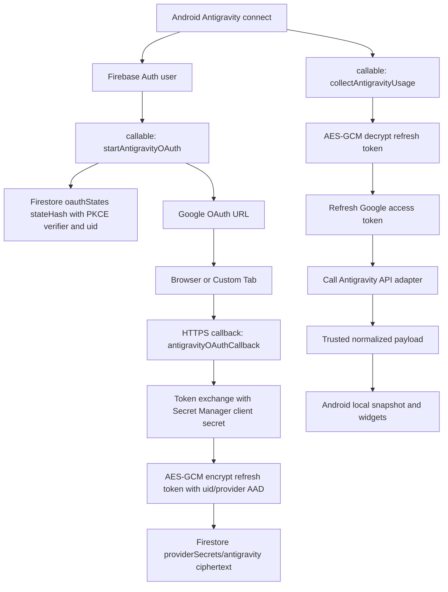

# Antigravity Firebase Token Gateway Spec

Date: 2026-05-29

## Objective

Implement Antigravity usage collection through a Firebase Functions token gateway because Antigravity has no reliable WebView usage surface and direct mobile calls to `cloudcode-pa.googleapis.com` / `daily-cloudcode-pa.googleapis.com` are private API calls that have already failed from the Android client.

The app must not ship a Google OAuth client secret. Any refresh token handled by the backend must be encrypted before it is written to Firestore. The current implementation uses AES-256-GCM with a 32-byte master key stored in Firebase Functions Secret Manager; Cloud KMS remains the intended later hardening step after the service path is proven.

## Primary Plan

Implementation plan:

`D:/Vibe Project/AI Usage for Mobile/docs/superpowers/plans/2026-05-29-antigravity-firebase-token-gateway.md`

## Context Protection Documents

These documents are part of this spec and must be updated during implementation so a later session can continue without repeating the same investigation.

- Progress log: `D:/Vibe Project/AI Usage for Mobile/docs/qa/antigravity-firebase-token-gateway-progress-2026-05-29.md`
- Troubleshooting log: `D:/Vibe Project/AI Usage for Mobile/docs/qa/antigravity-firebase-token-gateway-troubleshooting-2026-05-29.md`

Update the progress log after each test addition, implementation step, Firebase emulator/deploy step, Android install, and runtime validation. Update the troubleshooting log whenever a failure is diagnosed or a known failure mode is confirmed.

If context is compacted or a new session resumes this work, read this spec first, then the implementation plan, then the progress and troubleshooting documents before touching code. The progress document is the source of truth for completed steps; the troubleshooting document is the source of truth for repeated failure modes and already-rejected approaches.

## Decision

Antigravity moves from client-only WebView/API collection to a Firebase Functions token gateway.

This supersedes the previous backendless Antigravity direction documented on 2026-05-28. Gemini remains WebView usage-page based because `https://gemini.google.com/usage` exposes user-visible usage data. Antigravity does not have an equivalent confirmed web usage page, so WebView extraction is not a sufficient source of truth.

## Non-Negotiable Constraints

1. Do not hardcode a Google OAuth client secret in Android.
2. Do not store refresh tokens in Firestore plaintext.
3. Do not log authorization codes, access tokens, refresh tokens, cookies, full auth headers, raw provider HTML, or raw private API bodies.
4. Do not claim Firebase bypasses private API allowlisting. If the backend OAuth client is rejected by Antigravity/Cloud Code private API, surface `BACKEND_API_FORBIDDEN` and stop treating the provider as connected.
5. Do not mark Antigravity `CONNECTED` until a trusted usage payload has been normalized into usage lines.
6. Do not make Firebase Remote Config the permission solution. Remote Config can tune endpoints or flags later, but it cannot grant private API access.

## Architecture

Android owns user interaction, Firebase Auth identity, snapshot cache, dashboard, notification, and widget rendering.

Firebase Functions owns Antigravity OAuth code exchange, refresh token encryption/decryption, access token refresh, Antigravity private API calls, payload normalization boundary, and token revocation.

Firestore stores only metadata and encrypted token ciphertext. Functions performs AES-256-GCM encryption and decryption with a Secret Manager master key during the first production validation phase. Secret Manager also stores the Google OAuth web client secret used by Functions. App Check is required for callable Functions when the app is built for real devices; debug App Check may be used for local emulator/dev flows. Cloud KMS should replace the AES master-key Secret once Antigravity OAuth and collection are confirmed viable.



## Firebase Functions API

### `startAntigravityOAuth`

Type: callable function.

Input:

```json
{
  "returnToApp": true
}
```

Auth requirements:

- Firebase Auth required.
- App Check required outside local debug/emulator use.

Behavior:

- Generate high-entropy `state`.
- Generate PKCE `code_verifier` and `code_challenge`.
- Store state record with a 10 minute expiration.
- Return an OAuth URL using the server-side Google OAuth web client.

Output:

```json
{
  "authorizationUrl": "https://accounts.google.com/o/oauth2/v2/auth?...",
  "expiresAt": "2026-05-29T06:10:00Z"
}
```

Required scopes:

- `https://www.googleapis.com/auth/cloud-platform`
- `https://www.googleapis.com/auth/userinfo.email`
- `https://www.googleapis.com/auth/userinfo.profile`

OAuth parameters:

- `access_type=offline`
- `prompt=consent`
- `response_type=code`
- `code_challenge_method=S256`

### `antigravityOAuthCallback`

Type: HTTPS function.

Input: Google OAuth redirect query.

Behavior:

- Validate `state`.
- Reject expired or already consumed state records.
- Exchange authorization code with Google token endpoint.
- Require a nonblank `refresh_token`.
- Encrypt refresh token with AES-256-GCM and the configured Secret Manager master key.
- Store encrypted token metadata under the authenticated uid mapped from the state record.
- Mark the state record consumed.
- Return a minimal success HTML page and, if practical, redirect to the Android app via deep link.

### `collectAntigravityUsage`

Type: callable function.

Input:

```json
{
  "force": false
}
```

Behavior:

- Require Firebase Auth and App Check.
- Read encrypted token doc for the caller uid.
- AES-GCM decrypt the refresh token using the exact AAD.
- Refresh a Google access token.
- Call the Antigravity API adapter.
- Return only normalized trusted usage payload or a typed failure.

Success output:

```json
{
  "ok": true,
  "provider": "antigravity",
  "source": "firebase_gateway",
  "payload": {
    "provider": "antigravity",
    "account": "redacted-or-omitted",
    "plan": "Google AI Pro",
    "models": {}
  }
}
```

Failure output:

```json
{
  "ok": false,
  "provider": "antigravity",
  "errorKind": "BACKEND_API_FORBIDDEN",
  "requiresAuth": false,
  "retryable": false
}
```

### `disconnectAntigravity`

Type: callable function.

Behavior:

- Require Firebase Auth and App Check.
- Decrypt refresh token only if needed for revoke.
- POST to Google token revoke endpoint.
- Delete token doc and state metadata for the provider.
- Return success even if revoke fails after deletion, but include a redacted warning code.

## Firestore Data Model

Client SDK must not directly read or write these collections. Access goes through Functions only.

### `antigravityOAuthStates/{stateHash}`

```json
{
  "uid": "firebase-uid",
  "providerId": "antigravity",
  "stateHash": "sha256-base64url",
  "codeVerifier": "pkce-verifier",
  "redirectAfterAuth": "aiquota://provider/antigravity",
  "createdAt": "serverTimestamp",
  "expiresAt": "2026-05-29T06:10:00Z",
  "consumedAt": null
}
```

This record is short lived. Firestore TTL should be enabled on `expiresAt`.

### `users/{uid}/providerSecrets/antigravity`

```json
{
  "providerId": "antigravity",
  "oauthClientId": "web-client-id.apps.googleusercontent.com",
  "scopes": [
    "https://www.googleapis.com/auth/cloud-platform",
    "https://www.googleapis.com/auth/userinfo.email",
    "https://www.googleapis.com/auth/userinfo.profile"
  ],
  "encryptedRefreshToken": "v1.base64url-iv.base64url-tag.base64url-ciphertext",
  "tokenEncryptionProvider": "aes-gcm-secret",
  "tokenKeyVersion": "v1",
  "aadVersion": "v1",
  "createdAt": "serverTimestamp",
  "updatedAt": "serverTimestamp",
  "lastRefreshAt": null,
  "lastCollectAt": null,
  "lastStatus": "TOKEN_STORED",
  "lastErrorKind": null
}
```

The AAD value for AES-GCM encryption and decryption must be:

```text
uid:{uid}:provider:antigravity:oauthClient:{oauthClientId}:aad:v1
```

If the AAD changes, decryption must fail. Do not silently try alternate AAD values except during an explicit migration task.

## Secret And Encryption Requirements

Secret Manager secrets:

- `ANTIGRAVITY_GOOGLE_OAUTH_CLIENT_ID`
- `ANTIGRAVITY_GOOGLE_OAUTH_CLIENT_SECRET`
- `ANTIGRAVITY_GOOGLE_OAUTH_REDIRECT_URI`
- `ANTIGRAVITY_TOKEN_MASTER_KEY`

`ANTIGRAVITY_TOKEN_MASTER_KEY` must be a 32-byte AES key encoded as base64, base64url, hex, or a 32-byte raw string. Generate it with a local cryptographic RNG and never log it.

Cloud KMS later hardening:

- Symmetric key: `antigravity-oauth-refresh-token`
- Functions service account needs `cloudkms.cryptoKeyVersions.useToEncrypt` and `cloudkms.cryptoKeyVersions.useToDecrypt`.
- Android clients receive no KMS permissions.

## Antigravity API Adapter

The first adapter remains the existing private Code Assist shape because it is the only known candidate:

- `POST https://cloudcode-pa.googleapis.com/v1internal:loadCodeAssist`
- `POST https://cloudcode-pa.googleapis.com/v1internal:fetchAvailableModels`

The adapter must be isolated behind a server module so alternate endpoints can be tested later without touching Android UI or token storage.

Request body baseline:

```json
{
  "metadata": {
    "ideType": "IDE_UNSPECIFIED",
    "platform": "PLATFORM_UNSPECIFIED",
    "pluginType": "ANTIGRAVITY"
  }
}
```

Trusted payload criteria:

- HTTP 2xx.
- JSON parse succeeds.
- `models` is an object or array.
- At least one non-internal model has a display label and `remainingFraction` or equivalent quota value.

If `loadCodeAssist` or `fetchAvailableModels` returns 403/permission denied, return `BACKEND_API_FORBIDDEN`. Do not ask the Android app to re-login for this error.

## Android Integration

Add a Firebase-backed Antigravity connector while preserving the local snapshot/widget architecture.

Target Android flow:

1. User taps Antigravity connect.
2. App ensures Firebase Auth exists.
3. App calls `startAntigravityOAuth`.
4. App opens returned OAuth URL.
5. After callback success, app polls or receives return intent and calls `collectAntigravityUsage`.
6. Trusted payload goes through `ProviderUsageNormalizer.normalize(ProviderId.ANTIGRAVITY, rawPayload, ProviderPayloadSource.PROVIDER_API)`.
7. Save `CONNECTED` only after normalization returns usage lines.
8. Foreground service uses the same connector for automatic refresh.

State mapping:

| Backend result | Android state |
| --- | --- |
| trusted payload | `CONNECTED` |
| `TOKEN_MISSING`, `REFRESH_TOKEN_REVOKED`, `GOOGLE_REFRESH_FAILED` | `DISCONNECTED` |
| `BACKEND_API_FORBIDDEN` | `UNAVAILABLE` with backend-required/private-api message |
| network timeout, 5xx, schema incomplete | keep previous snapshot; if no lines, `ERROR`/`UNAVAILABLE`; continue auto retry |
| explicit user disconnect | remove local snapshot and call backend disconnect |

## Testing Requirements

Functions unit tests:

- OAuth URL contains offline access, consent prompt, PKCE challenge, and required scopes.
- Token exchange stores only ciphertext.
- AES-GCM AAD mismatch fails decrypt.
- Firestore token docs reject forbidden plaintext fields in tests.
- `collectAntigravityUsage` maps 403 to `BACKEND_API_FORBIDDEN`.
- `disconnectAntigravity` deletes token doc even if revoke returns non-2xx.

Android unit/source tests:

- Antigravity definition switches to Firebase gateway/native refresh mode when connector is added.
- App does not launch `WebLoginActivity` for Antigravity gateway connect.
- `client_secret` does not appear in Android source/build config.
- Gateway success normalizes through existing Antigravity normalizer.
- `BACKEND_API_FORBIDDEN` does not become `DISCONNECTED`.
- `TOKEN_MISSING` / refresh revoked becomes `DISCONNECTED`.
- Automatic refresh includes retryable backend failures and excludes disconnected provider.

Runtime checks:

- Firebase emulator flow for start/callback/collect with mocked Google and mocked Antigravity responses.
- Android debug install with Firebase emulator endpoint.
- Real-device or emulator App Check debug token path.
- Redacted logcat verification.

## Rollout Rules

1. Implement behind an Antigravity Firebase gateway feature flag.
2. Keep existing Antigravity WebView path disabled or fallback-only until gateway success is proven.
3. If backend returns `BACKEND_API_FORBIDDEN`, show a clear unsupported/private API message and do not loop user through OAuth.
4. Do not deploy Functions with plaintext token storage even temporarily.
5. Do not include raw private API bodies in Analytics, Crashlytics, Firestore, or logs.

## References

- Cloud KMS encrypt/decrypt for later hardening: https://cloud.google.com/kms/docs/encrypt-decrypt
- Cloud KMS additional authenticated data for later hardening: https://cloud.google.com/kms/docs/additional-authenticated-data
- Firebase callable functions: https://firebase.google.com/docs/functions/callable
- Firebase Functions parameters and Secret Manager: https://firebase.google.com/docs/functions/config-env
- Firebase App Check: https://firebase.google.com/docs/app-check

## Residual Risk

Firebase Functions solves Android client secret exposure and keeps refresh tokens out of Firestore plaintext. The current AES Secret phase has weaker key isolation than Cloud KMS because Functions can read the master key. It does not guarantee Antigravity private API access. If Google/Antigravity rejects the backend OAuth client or project, the correct product behavior is `UNAVAILABLE` / unsupported, not repeated login prompts.
